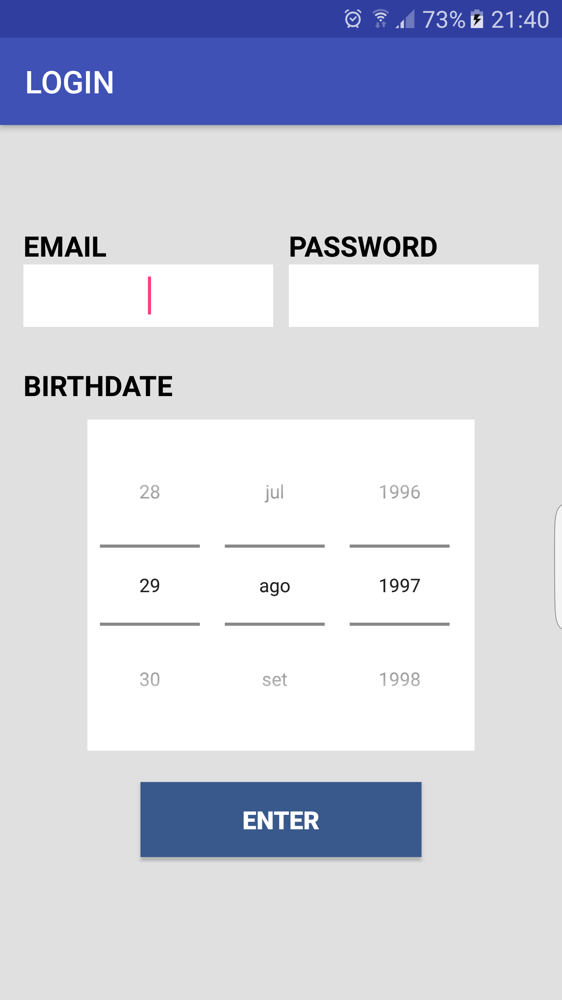
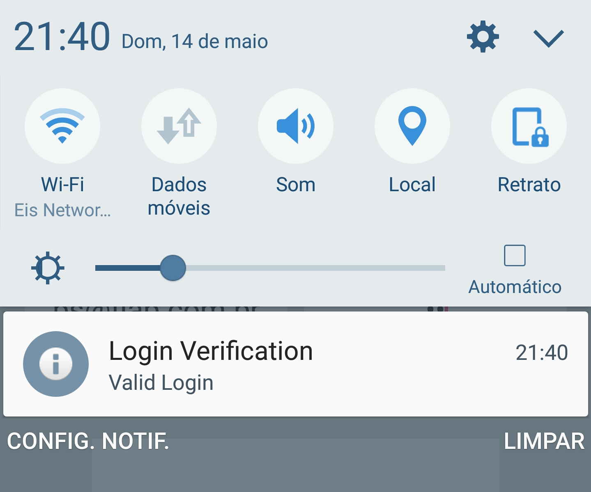
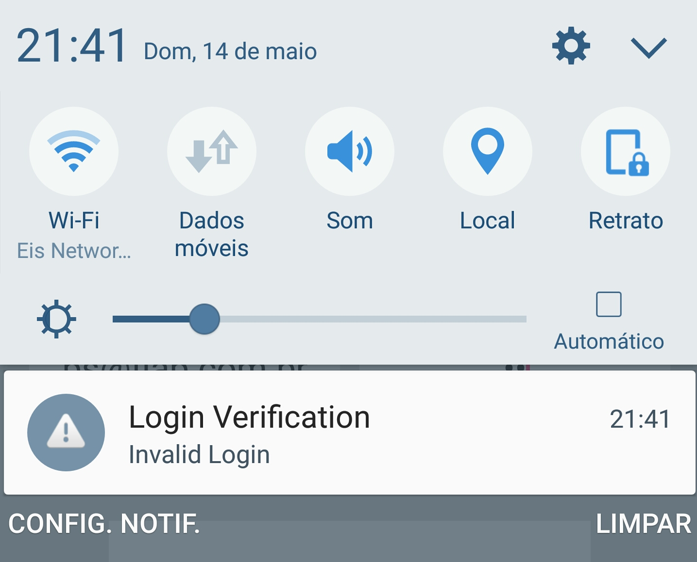

# Android LoginService
### A simple android app using service to validate login

Welcome to my app!!

If you want to test it, follow these steps.

- Build and Deploy it on real device or AVD

Our data is based on a mockup, so you need to use this inputs to test the application

- **Email:** ps@fiap.com.br
- **Password:** 10
- **Birthdate:** any date greater than 18 year

These datas will create a notification with a message saying your login was validated

If you enter something unexpected you'll be notificated with a message saying your login wasn't validated

This app was made as a university exercise for the subject "Advanced Mobile Development" at FIAP